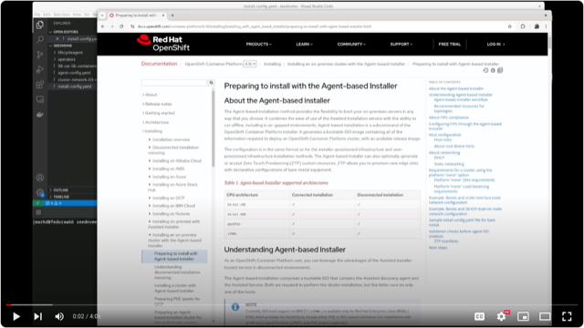
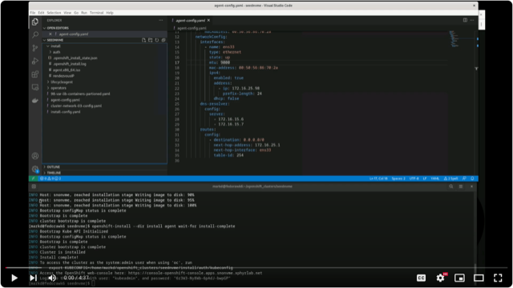
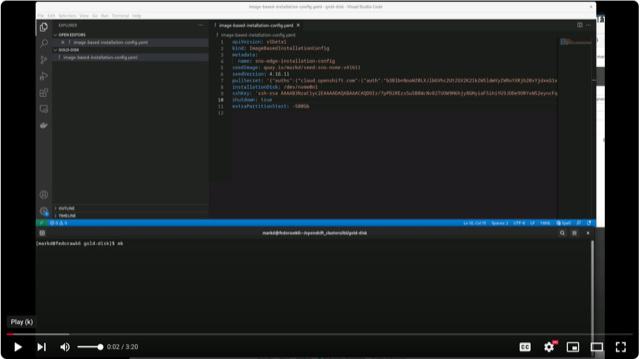
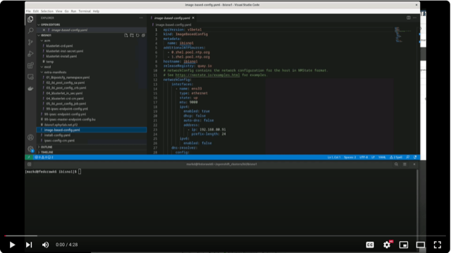
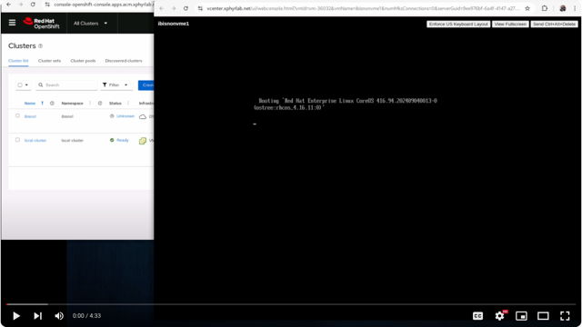

# Intro

The following documents an UNSUPPORTED process to deploy an OpenShift SNO cluster in a remote (Edge) site and use IPSec to tunnel (VPN) to a hub cluster at a central site allowing management via ACM. 

This is a Proof of Concept(PoC), and not meant for production use, but it shows what is possible.

We are tracking "Opportunities", or "Challenges", (or some may call them "Issues") in the file [CHALLENGES.md](./CHALLENGES.md)

The following diagram shows what we are attempting to achieve with this demo:


## Workflow

This PoC leverages the following technologies from Red Hat:

* [OpenShift Agent Based Installer](https://docs.openshift.com/container-platform/4.17/installing/installing_with_agent_based_installer/preparing-to-install-with-agent-based-installer.html)
* [Image Based Installation](https://access.redhat.com/articles/7075493)
* [IPsec encryption for external traffic](https://docs.openshift.com/container-platform/4.17/networking/network_security/configuring-ipsec-ovn.html#nw-ovn-ipsec-external_configuring-ipsec-ovn)
* [NMState Operator](https://docs.openshift.com/container-platform/4.17/networking/k8s_nmstate/k8s-nmstate-about-the-k8s-nmstate-operator.html)
* [Red Hat Advanced Cluster Management for Kubernetes 2.11](https://docs.redhat.com/en/documentation/red_hat_advanced_cluster_management_for_kubernetes/2.11)

In order to reproduce this demo you will need to follow these steps. 

1. Install SNO cluster using the "Agent Based Installer" or similar technology.
2. Install the required additional operators that will be needed on your Edge cluster
3. Install the Lifecycle Operator
4. Capture a Seed Image
5. Build a Seed Boot ISO
6. Install Seed Boot ISO on target hardware
7. Create ACM secret for joining the cluster
8. Create Image Configuration ISO Image
9. Boot target Edge Hardware with Image Configuration ISO installed
10. Validate connectivity with ACM

## Requirements

In order to reproduce this PoC you will need the following:

* Minimum of TWO datacenters or locations for deploying OpenShift
  * ACM Hub should be pre-installed in one location (Referred to as "HUB SITE" for the remainder of this document)
  * Edge Location (Referred to as "EDGE SITE" for the remainder of this document) where you will be deploying the SNO cluster
* HUB SITE will require an IPsec service/router for the remote EDGE SITE nodes to connect to. Creation and configuration of IPSec service is outside the scope of this document
  * HUB SITE IPsec service should supply a signed certificate for use for authentication in pk12 format
  * Notes on how to build a IPSec server are located in the file [IPSEC-Install-Notes.md](/vpn-ipsec/IPSEC-Install-Notes.md)
* HUB SITE hardware with minimum of 32GB  Ram, 12 Cores, and 700GB of disk space

## Building the DEMO setup

### Build Default SNO cluster to be used as a "SEED" server

A Seed cluster will be required to create the base Image. The Seed cluster must be the same or similar in hardware, specifically the local storage configuration. The disk size and layout will be copied from your source Seed cluster to all subsequent EDGE SITE nodes.

> **NOTE:** The "seed cluster" is a throw-away cluster. Once you take a seed image you can no longer use this cluster and it will need to be rebuilt prior to taking a new image. 

Follow instructions for creating an [Agent based install](https://docs.openshift.com/container-platform/4.17/installing/installing_with_agent_based_installer/preparing-to-install-with-agent-based-installer.html). You will need to create the following files:

* install-config.yaml
* agent-config.yaml

See [Creating the preferred configuration inputs](https://docs.openshift.com/container-platform/4.17/installing/installing_with_agent_based_installer/preparing-to-install-with-agent-based-installer.html) for additional details.

To use the IBI Install process, we need to create a special configuration file to partition `/var/lib/containers` into its own partition. For this demo we are using a 700Gb disk, and the example configuration below will create a primary 120Gb partition and a 530Gb partition to be used by `/var/lib/containers`.

See an example file in `seedcluster/openshift/98-var-lib-containers-partitioned.yaml` in this repository. Be sure to update the following section **spec.config.storage.disks.device** 

* Ensure you update the disk device name based on your hardware
* Ensure you leave a minimum of 120Gb for the "root" filesystem of CoreOS
* Ensure that your `var/lib/containers` volume is at least 500Gb in size

We will also enable IPSec as part of the cluster install. See the file `seedcluster/openshift/cluster-network-03-config.yaml` in this repository for the contents.

Once you have created the `install-config.yaml, agent-config.yaml, 98-var-lib-containers-partitioned.yaml, cluster-network-03-config.yaml` files run the following commands to create an agent install:

```bash
$ mkdir -p install/openshift
$ cp agent-config.yaml install-config.yaml install
$ cp 98-var-lib-containers-partioned.yaml  cluster-network-03-config.yaml install/openshift/
```

Ensure that your directory structure looks like this:

```
install
├── openshift
│   ├── cluster-network-03-config.yaml
│   └── 98-var-lib-containers-partioned.yaml
├── agent-config.yaml
└── install-config.yaml
```

Once you have the files in the proper location, create the agent image ISO.

```bash
$ openshift-install --dir install agent create image
```

Use the `agent.x86_64.iso` file to create your Seed cluster.

You can follow the progress of the install:

```bash
$ openshift-install --dir install agent wait-for bootstrap-complete --log-level=info && \
  openshift-install --dir install agent wait-for install-complete
```

#### YouTube Video:

The following video will show you the above process:

[](https://youtu.be/RzD7ky_vX3U)

### Create Seed Image

#### Configure Image

As part of the Demo, we will add the following operators to the seed cluster PRIOR to taking the seed image.

* SRIOV - install and deploy the SRIOV config
* NFD - install the operator but do NOT deploy the NFD feature
* NMState - install the operator but do NOT deploy the NMstate feature
* LVM Storage Operator - Install the operator but do not configure
* Ingress Node Firewall Operator - Install the operator and configure the base deployment
* Lifecycle Agent - install the operator

> **NOTE:** files in `seedcluster/operators` can be used to create these operators from the command line.

#### Pull additional containers required

In order to pre-cache additional images not currently running in the seed cluster, we will need to SSH to the seed cluster and run `podman pull <imagename>` for all additional container images you want as a part of the base image.

```bash
ssh core@<seedcluster>
# the guestbook-php image is currently causing failures. don't do right now
#sudo podman pull ghcr.io/rh-telco-tigers/guestbook-php/guestbook-php
sudo podman pull quay.io/markd/ibi-post-config
# note: the image from the registry below requires login ... need to set up the pull-secret.json file first for this one
sudo podman pull registry.redhat.io/rhscl/mariadb-103-rhel7:latest --authfile=/root/pull-secret.json
# check to ensure that the extra images you need are listed in the output from this command
sudo crictl images
```

#### Capture Seed Image

To capture the seed image, we will need to upload the configuration to a Container Registry. The follow the instructions here: [Generating a seed image with the Lifecycle Agent](https://access.redhat.com/articles/7075493#generating-a-seed-image-with-the-lifecycle-agent-12). Once you have created the secret.

Create a seedgenerator.yaml file updating the image name to match where you will be storing the seed image:

```yaml
apiVersion: lca.openshift.io/v1
kind: SeedGenerator
metadata:
  name: seedimage 
spec:
  seedImage: quay.io/<username>/seed-sno:v41611
```

```
$ oc apply -f lifecycleagent/seed-secret.yaml
$ oc apply -f lifecycleagent/seedgenerator.yaml
```

At this point the cluster will become un-responsive while the image is created. When the cluster becomes responsive again, you can validate that the seed image was created by running:

```
$ oc get seedgenerator -o yaml
```

The output should contain "Seed Generation completed: True".

##### YouTube Video:

The following video will show you the above process:

[](https://youtu.be/Q-59QiwnqPE)

#### Generate Seed Image Install Disk

With the seed image created, you will need to generate an "Installer Image", this image is used to apply the base "un-configured" OpenShift cluster that can be applied to multiple servers. The same image can be used for multiple "EDGE SITE" nodes.

```yaml
apiVersion: v1beta1
kind: ImageBasedInstallationConfig
metadata:
  name: sno-edge-installation-config
seedImage: <seed image from SeedGenerator.yaml>
seedVersion: 4.16.11
pullSecret: '<pull secret>'
installationDisk: /dev/sda
sshKey: '<ssh-key-here>'
shutdown: true
```

```
$ cd ../ibi/
$ mkdir ibi-iso-installer
$ cp image-based-installation-config.yaml ibi-iso-installer
$ openshift-install417 image-based create image --dir ibi-iso-installer
```

Use the resulting ISO image to install the base "un-configured" SNO cluster on your target EDGE SITE machines. Once the image is installed on the hardware, the system will power down for delivery.

> **NOTE:** you can follow the install process by ssh to the node and run `sudo journalctl -u install-rhcos-and-restore-seed.service --follow`

##### YouTube Video:

The following video will show you the above process:

[](https://youtu.be/1uvkmKU_0M0)

## Deploying an EDGE SITE machine

Now that we have our base image installed on hardware that is bound for the EDGE SITE, we need to create the site configuration. This includes two steps:

1. Generate ACM Klusterlet configuration files
2. Generate Install-config and agent-config and extra-manifests files for configuring the node network

### Generate ACM Klusterlet config file

Using the template files in `acm/cluster-import` create a new managed cluster definition, replacing <clusterName> with the name of the remote cluster.

Apply the managed cluster definition:

```sh
oc create -f new-managed-cluster.yaml 
managedcluster.cluster.open-cluster-management.io/customer2 created
klusterletaddonconfig.agent.open-cluster-management.io/customer2 created
```

We now need to extract the Cluster Definition and ACM secret used for authentication:

```sh
export CLUSTERNAME=<clusterName>
oc get secret/${CLUSTERNAME}-import -n ${CLUSTERNAME} -o json | jq -c 'pick(.metadata.name, .metadata.labels, .apiVersion, .data."crds.yaml", .data."import.yaml", .kind, .type)' | jq '.metadata += {"namespace":"ibi-post-config","name":"acm-import-secret"}' > 04_acm-import.json
```

> **NOTE:** In order for the above command to work, the openshift-installer must support JSON files in the extra-manifests directory. Once [PR-9136](https://github.com/openshift/installer/pull/9136) is released, this problem will go away.

Copy the resulting `04_acm-import.json` to the `extra-manifests` directory

We will use the files above as part of our EDGE SITE configuration ISO in the next section.

### Generate the EDGE SITE configuration ISO

The configuration ISO is used to apply all configuration to the EDGE SITE node, via a CD-ROM or USB key. There may be other options for supplying this configuration as well, but they need to be explored.

#### Create 04_ipsec-nmstate-cm-template.yaml

Use the file `extra-manifests-templates/04_ipsec-nmstate-cm-template.yaml` update the fields for _ipsec-config.yaml_ in the file, and then place a copy of the file in `extra-manifests` directory

#### Create 99-ipsec-endpoint-config.yaml

To complete this step, you will need to have a "pk12" formatted certificate from your HUB SITE IPSec server for authentication. This file needs to be imported on the EDGE SITE cluster in order for IPsec to create the tunnel. Name the certificate '<hostname>.<basedomain>.pk12' and place in the root directory of this git repo.

You will need the `butane` executable to build the `99-ipsec-endpoint-config.yaml` file. Butane can be obtained by doing the following:

```bash
$ curl https://mirror.openshift.com/pub/openshift-v4/clients/butane/latest/butane --output butane
$ chmod +x butane
$ sudo cp butane /usr/local/bin
```

Once `butane` is installed, you can run the following command to create the new machineConfig file:

```bash
$ butane extra-manifests/99-ipsec-endpoint-config.bu -o ./extra-manifests/99-ipsec-endpoint-config.yaml -d .
```

#### Create EDGE SITE Configuration ISO

If you are missing any of the files go back in this section, and follow the instructions for creating the appropriate file.

```bash
mkdir -p install/extra-manifests
cp install-config.yaml image-based-config.yaml install
cp -r extra-manifests/ install
```

Before running the commands to create the ISO directory ensure that you have the following files:

```
install
├── extra-manifests
│   ├── 01_ibipostcfg_namespace.yaml
│   ├── 02_ibi_post_config_sa.yaml
│   ├── 03_ibi_post_config_crb.yaml
|   ├── 04_acm-import.json
│   ├── 04_ipsec-nmstate-cm.yaml
│   ├── 05_ibi_post_config_job.yaml
│   └── 99-ipsec-endpoint-config.yml
├── image-based-config.yaml
└── install-config.yaml
```

> **NOTE:** [PR Request 9136](https://github.com/openshift/installer/pull/9136) must be merged into the installer before the json file imports will work.

You can now run the installer:

```bash
$ openshift-install417 image-based create config-image --dir install/
```

Using the resulting ISO file, attach to the EDGE SITE server and boot the server. After about 20-30 minutes your cluster should be up and running, and connected to the HUB ACM site.

> **NOTE:** The "ibi_post_config" files are a separate project https://github.com/xphyr/ibi_post_config. This project contains the scripting used to run a post configuration job that finalizes the configuration of the SNO cluster, including applying the IPSec files and configuring the klusterlet to run on the cluster. This can be further modified to address additional features that may need to be added to a cluster, prior to it joining the ACM Hub.

#### YouTube Video:

The following video will show you the above process:

[](https://youtu.be/eUI_oZlvoVQ)

#### YouTube Video:

This is the final video recording. This recording will show the "Edge" device booting up, and configuring based on the config-iso that was created in the last section, establishing the IPSec tunnel and joining the ACM cluster.

[](https://youtu.be/GcfmU9onK0A)

## Application Deployment from ACM

ACM will control the deployment of applications on the remote site. In order to achive this we will need one of the following repositories:

* Git
* Helm
* Object Storage (S3)

We will use an example application for deployment called [guestbook-php](https://github.com/rh-telco-tigers/guestbook-php). We will need to define a subscription. You can leverage the `acm\guestbook-php-application.yaml` file as a basis for creating an application in your ACM hub.  See [Red Hat ACM for Kubernetes - Applications](https://docs.redhat.com/en/documentation/red_hat_advanced_cluster_management_for_kubernetes/2.11/html/applications/index) for more details.

## References

* [NMState IPSec configuration](https://nmstate.io/devel/yaml_api.html#ipsec-encryption)
* [Libreswan Configuration](https://libreswan.org/man/ipsec.conf.5.html)
* [OpenShift Appliance Builder](https://access.redhat.com/articles/7065136)
* [Image Based Installation](https://access.redhat.com/articles/7075493)
* [ibi_post_config](https://github.com/xphyr/ibi_post_config)